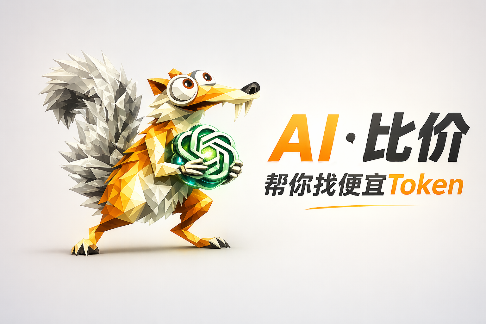
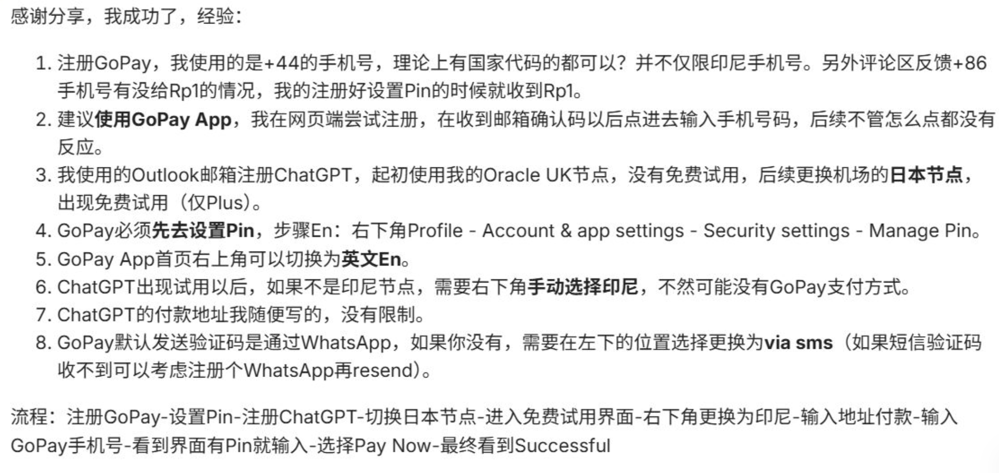
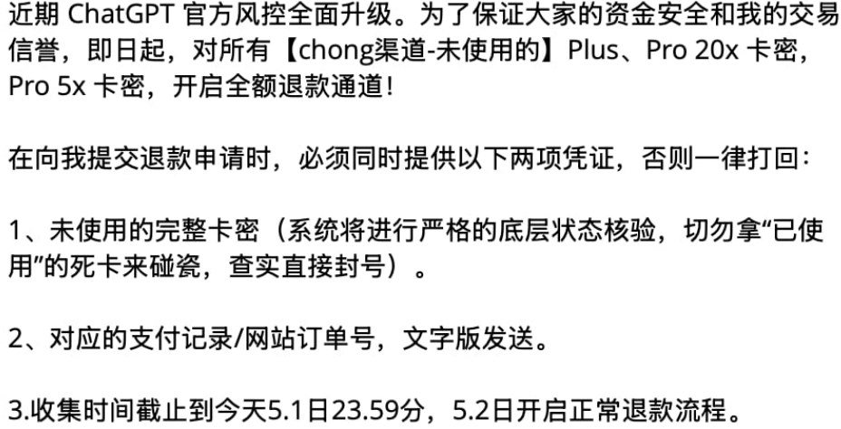

  

# Aibijia：多平台抓取价格，一键比价

网站地址👉：[AI比价，帮你找便宜Token](https://aibijia.org)

---

**免责声明：本站所有内容采集自网络，仅供参考，不构成购买建议。**

[网站定位](#网站定位) · [推荐和避雷](#推荐和避雷) · [以后呢](#以后呢) · [现在的行情](#现在的行情)

## 网站定位

目前AI账号的价格很混乱，同一种类型的账号，不同平台、不同代理商的价格很“五彩缤纷“。

比如ChatGPT plus CDK，有的卖30，有的卖40，还有的卖60。

但如果仔细对比它们的提货渠道，就会发现，它们是从同一个源头拿的货，只不过各自的加价不同，账号本质上没什么区别。

所以，为了节省反复横跳比价格的时间，我就做了这个比价网站。

但是没想到，这个网站会伤害到一些代理的利益。

他们用bot冲了电报群。

当时我在高铁上打盹，睁开眼发现群里瞬间冲进来一千多个bot，看着机器人光速刷屏，那场面还挺壮观的。

果然科学技术才是第一生产力。

## 推荐和避雷

如果您有靠谱的信源（渠道靠谱、售后靠谱），欢迎分享到这里，网站有提交入口。

如果被坑了，也可以在本仓库分享经验，帮助他人避雷，功德+1。

## 以后呢

目前来看，从卡网买cdk，相比于官方还是有一些性价比的。

30块钱的plus，能坚持两个星期就很可以了。

但是如果奥特曼拉闸、渠道持续涨价，这性价比就很低了。

不如走官方订阅了，毕竟土区的plus，也才80块钱。

或者是几个人合开GPT pro 20x。

再或者会有新的低价路子出现......

## 现在的行情

🔥🔥🔥 2026年5月1日 中午更新

之前的plus pro账号，又被风控封锁了一大批。

很多人开始考虑官方渠道了。

但是我在某个群里看到，有人在研发新的「技术」，继续观察看看。

---

🔥🔥🔥 2026年5月1日 更新

自己手搓印尼号方法⬇️。

网络上一些很便宜的印尼日抛plus，应该就是这个方法做出来的。

但是方法既然已经公开了，就很可能失效了。

所以仅供参考。

ChatGPT pro 5x 的价格：

据我了解，分销商从大代理那里拿货的底价大概是140元，所以个人能买到的价格在150-160之间。

要是有人卖200多，那就有点太夸张了，建议换一家，毕竟都是分销，账号本身其实没差。

ChatGPT pro 20x 的价格，个人能买到的价格在240-260之间。

今天是五一，随着OpenAI的风控策略调整，chong渠道的供应商，都开始主动要求用户退款了。

---

想了解靠谱信息，👉[telegram频道地址](https://t.me/ai_bi_jia_notice)，一起加群交流～
