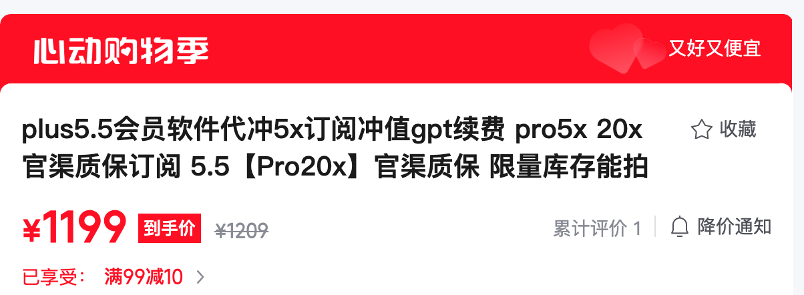
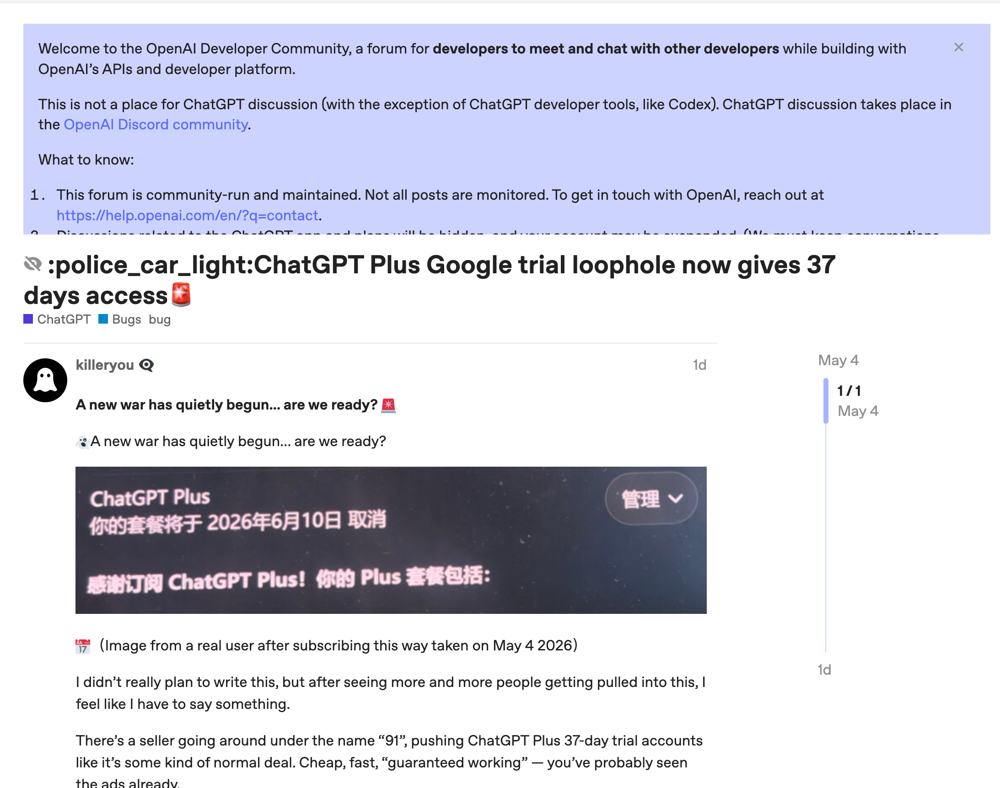

# Aibijia：多平台抓取价格，一键比价

AI比价网站地址👉：[AI比价，帮你找便宜Token](https://aibijia.org)

AI论坛地址👉：[AI交流、vibe coding、内容创作、AI新闻、AI资源分享](https://withai.homes/)，欢迎来这里，一起做AI「原住民」。

AI工具导航👉：[古法手工维护的，好用好玩的AI导航站](https://github.com/ka-pi-ba-la/awesome-ai-tools/)，感谢star。

---

**免责声明：本站所有内容采集自网络，仅供参考，不构成购买建议。**

## 现在的行情

🔥🔥🔥 2026年5月22日 更新

现在的日抛plus价格在5元左右，稍微稳定能够用几天的，大概10元。「能用多久还是看OpenAI的风控，这个外界无法预测」

如果是ChatGPT网页版或codex的刚需用户、离开GPT就有戒断反应的，还是建议走官方充值渠道。

**具体教程可以在微信公众号搜索，已经有很多相关文章了。**

嫌麻烦的，也可以直接去京东搜索“ChatGPT”，现在有很多代充值plus、Pro的店铺，有些价格甚至非常划算。

比如ChatGPT Pro 20x，有的代充价格不到1200块钱，比自己充值只贵几十块，性价比挺高了。

---

🔥🔥🔥 2026年5月18日 更新

目前市面上依旧有零星的日抛plus账号，但是价格已经很昂贵，需要花费十几元。

十几元买的账号，可能只存活几个小时，运气好的能活几天，性价比已经很低了。

目前最好的方法，就是几个人组队订阅菲区官方的ChatGPT pro 20x套餐。

最困难的环节是支付，其实YouTube和L站都有很多教程的，就是麻烦些。

但这是目前使用GPT最稳妥省心的方式了。

今天在网络上看到一张图，差点没笑死。

---

🔥🔥🔥 2026年5月14日 更新

ChatGPT plus的低价账号来源渠道，几乎全面被封杀。

我在几个大代理电报群和发卡平台逛了逛，plus号都缺货了，说明这一波被杀的很彻底。

现在群里讨论最多的，都是从哪里可以开正规的plus、pro账号。

越来越多的人，开始考虑订阅官方套餐了。

🔥🔥🔥 2026年5月5日 更新

[冷酷杀手再次向官方举报bug渠道的ChatGPT plus账号](https://community.openai.com/t/chatgpt-plus-google-trial-loophole-now-gives-37-days-access/1380287)

---

🔥🔥🔥 2026年5月4日 更新

截止到现在，没听说有新的卡bug开低价会员的渠道。

之前的各个渠道源头都拉闸了，低价plus、pro全面断货。

卡网在售的plus和pro，多为之前的库存。

低价渠道消失后，很多天才程序员都陨落了。

其实大可不必。

拼车方案也是蛮有性价比的，而且更安全。

**比如，五六个人一起拼车菲律宾的ChatGPT pro20x。**

[AI比价网站，现在更新了各个模型、套餐，在不同地区，官方订阅价格的差价，可以很直观的看到哪个地区最便宜。](aibijia.org)

现在pro 20x，菲律宾的订阅价格折算成人民币，大概1100块钱（这个只是预估，会有小范围波动）。

20x就是20倍plus的用量，5月份还有额外的5倍plus用量的激励，加起来就是25倍。

个人使用，5倍的plus额度基本足够了。

25倍，可以找5个人拼车codex，再拼一个只用网页端不用codex的人，一车就是6个人。

在服务器上部署sub2api，给每个人分配限额。

成本分摊下来，一个人两百多。

可以说这个是目前非常有性价比的方案了。

这个路径最大的障碍就是海外支付。

支付可以去申请SAVO虚拟卡，教程去YouTube搜索。

https://www.youtube.com/watch?v=RjkXjDX3CmI

https://www.youtube.com/watch?v=yaecMdfGWsg

卡片需要入金激活，可以用币安。

如何用币安，也可以去YouTube去搜，有很多教程。

链上转账务必小心，转错了就没了，**必须先小金额尝试**。

卡片准备好之后，再准备一个菲律宾的节点。

然后去谷歌搜菲律宾地址生成器。

https://www.toolstip.cn/virtual/ph-city-hot-city-Quezon.html

https://www.meiguodizhi.com/ph-address/hot-city-Manila

开着菲律宾节点，去ChatGPT官网开通需要的套餐就行了。

有佬友建议，先开plus试试。

没问题再升级为pro，补齐差价即可。

在codex中使用的时候，如果频繁报503，大概率是账号的问题，等一天就会消失。

更多报错解决经验参考L站帖子：https://linux.do/t/topic/2066135/3

[如果想拼车，可以去这里发帖，或许会有同路的人。](https://forum.aibijia.org/t/carpool)

祝大家都能用上靠谱便宜放心的Token。

---

🔥🔥🔥 2026年5月1日 晚上更新

多个渠道已经停止销售pro账号，并启动了退款流程。

很多「天才程序员」就此陨落。

经过最近几次风控、掉号，不少人开始认真考虑订阅官方套餐，虽然贵，但是不用再担惊受怕封号了。

---

🔥🔥🔥 2026年5月1日 中午更新

之前的plus pro账号，又被风控封锁了一大批。

很多人开始考虑官方渠道了。

但是我在某个群里看到，有人在研发新的「技术」，继续观察看看。

---

🔥🔥🔥 2026年5月1日 更新

自己手搓印尼号方法⬇️。

网络上一些很便宜的印尼日抛plus，应该就是这个方法做出来的。

但是方法既然已经公开了，就很可能失效了。

所以仅供参考。

ChatGPT pro 5x 的价格：

据我了解，分销商从大代理那里拿货的底价大概是140元，所以个人能买到的价格在150-160之间。

要是有人卖200多，那就有点太夸张了，建议换一家，毕竟都是分销，账号本身其实没差。

ChatGPT pro 20x 的价格，个人能买到的价格在240-260之间。

今天是五一，随着OpenAI的风控策略调整，chong渠道的供应商，都开始主动要求用户退款了。

---
想了解靠谱信息，👉[telegram频道地址](https://t.me/ai_bi_jia_notice)，一起加群交流～
