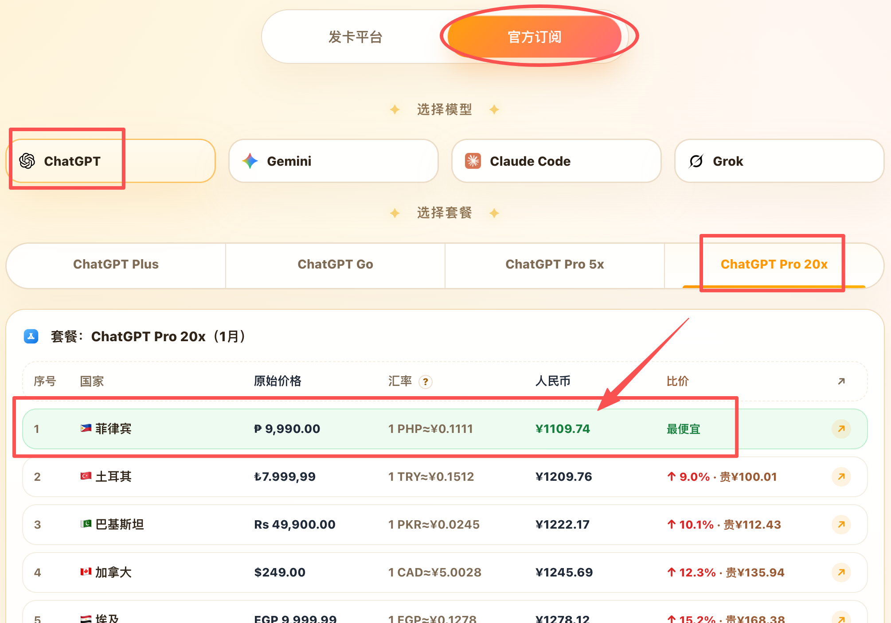
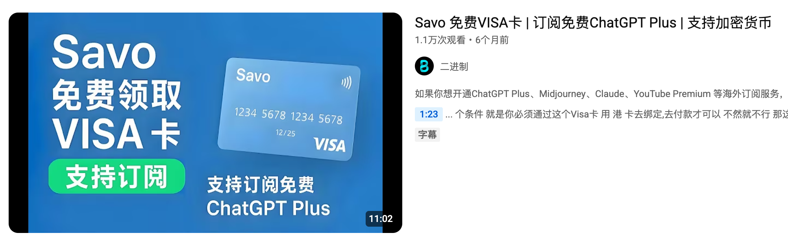
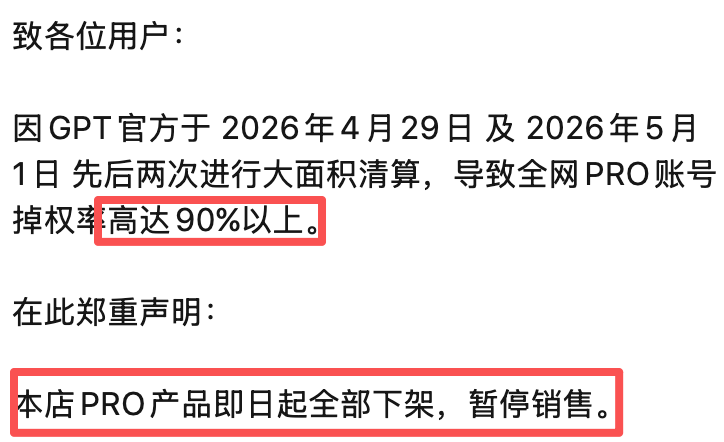
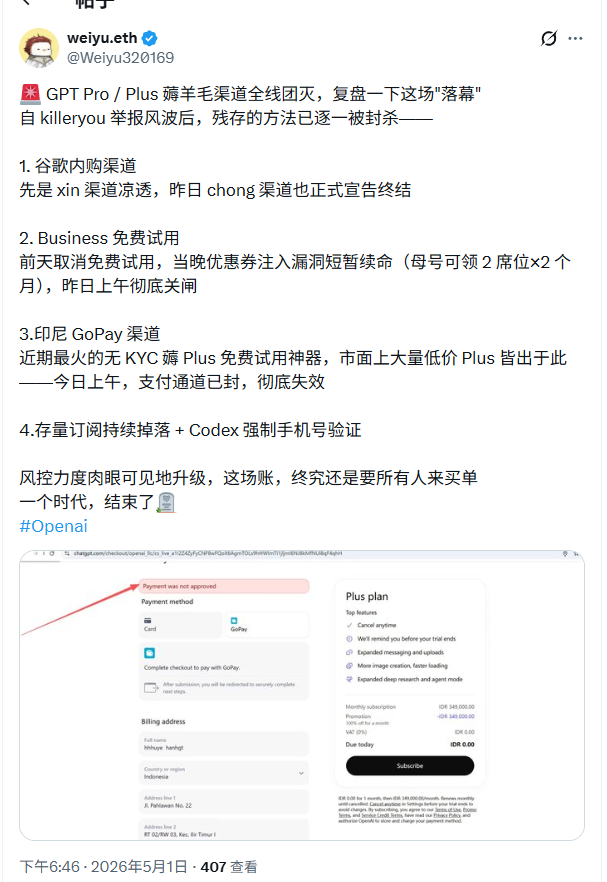
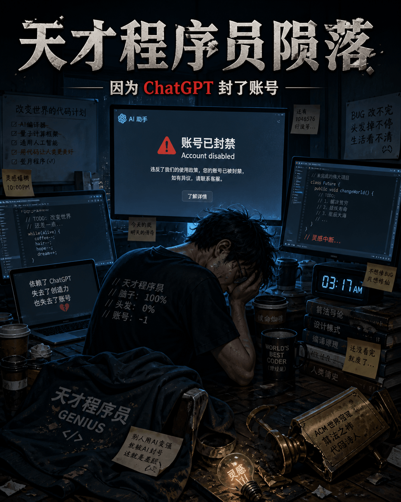

  

# Aibijia：多平台抓取价格，一键比价

AI比价网站地址👉：[AI比价，帮你找便宜Token](https://aibijia.org)

AI论坛地址👉：[with AI，与AI同行，积极拥抱AI浪潮](https://forum.aibijia.org/)，欢迎来这里，一起做AI「原住民」。

---

**免责声明：本站所有内容采集自网络，仅供参考，不构成购买建议。**

[网站定位](#网站定位) · [推荐和避雷](#推荐和避雷) · [以后呢](#以后呢) · [现在的行情](#现在的行情)

## 网站定位

目前AI账号的价格很混乱，同一种类型的账号，不同平台、不同代理商的价格很“五彩缤纷“。

比如ChatGPT plus CDK，有的卖30，有的卖40，还有的卖60。

但如果仔细对比它们的提货渠道，就会发现，它们是从同一个源头拿的货，只不过各自的加价不同，账号本质上没什么区别。

所以，为了节省反复横跳比价格的时间，我就做了这个比价网站。

但是没想到，这个网站会伤害到一些代理的利益。

他们用bot冲了电报群。

当时我在高铁上打盹，睁开眼发现群里瞬间冲进来一千多个bot，看着机器人光速刷屏，那场面还挺壮观的。

果然科学技术才是第一生产力。

## 推荐和避雷

如果您有靠谱的信源（渠道靠谱、售后靠谱），欢迎分享到这里，网站有提交入口。

如果被坑了，也可以在本仓库分享经验，帮助他人避雷，功德+1。

## 以后呢

目前来看，从卡网买cdk，相比于官方还是有一些性价比的。

30块钱的plus，能坚持两个星期就很可以了。

但是如果奥特曼拉闸、渠道持续涨价，这性价比就很低了。

不如走官方订阅了，毕竟土区的plus，也才80块钱。

或者是几个人合开GPT pro 20x。

再或者会有新的低价路子出现......

## 现在的行情

🔥🔥🔥 2026年5月4日 更新

截止到现在，没听说有新的卡bug开低价会员的渠道。

之前的各个渠道都拉闸了，低价plus、pro全面断货。

卡网在售的plus和pro，多为之前的库存。

低价渠道消失后，几个人拼车ChatGPT pro 20x会员，就成了比较优质的方案。

**比如，五六个人一起拼车菲律宾的ChatGPT pro20x。**

[AI比价网站，现在更新了各个模型、套餐，在不同地区，官方订阅价格的差价，可以很直观的看到哪个地区最便宜。](aibijia.org)

现在pro 20x，菲律宾的订阅价格折算成人民币，大概1100块钱（这个只是预估，会有小范围波动）。

20x就是20倍plus的用量，5月份还有额外的5倍plus用量的激励，加起来就是25倍。

个人使用，5倍的plus额度基本足够了。

25倍，可以找5个人拼车codex，再拼一个只用网页端不用codex的人，一车就是6个人。

在服务器上部署sub2api，给每个人分配限额。

成本分摊下来，一个人两百多。

可以说这个是目前非常有性价比的方案了。

最大的障碍就是海外支付。

支付可以去申请SAVO虚拟卡，教程去YouTube搜索。

https://www.youtube.com/watch?v=RjkXjDX3CmI

https://www.youtube.com/watch?v=yaecMdfGWsg

卡片需要入金激活，可以用币安。

如何用币安，也可以去YouTube去搜，有很多教程。

链上转账务必小心，转错了就没了，**必须先小金额尝试**。

卡片准备好之后，再准备一个菲律宾的节点。

然后去谷歌搜菲律宾地址生成器。

https://www.toolstip.cn/virtual/ph-city-hot-city-Quezon.html

https://www.meiguodizhi.com/ph-address/hot-city-Manila

开着菲律宾节点，去ChatGPT官网开通需要的套餐就行了。

有佬友建议，先开plus试试。

没问题再升级为pro，补齐差价即可。

在codex中使用的时候，如果频繁报503，大概率是账号的问题，等一天就会消失。

更多报错解决经验参考L站帖子：https://linux.do/t/topic/2066135/3

祝大家都能用上靠谱便宜放心的Token。

---

🔥🔥🔥 2026年5月1日 晚上更新

多个渠道已经停止销售pro账号，并启动了退款流程。

很多「天才程序员」就此陨落。

经过最近几次风控、掉号，不少人开始认真考虑订阅官方套餐，虽然贵，但是不用再担惊受怕封号了。

---

🔥🔥🔥 2026年5月1日 中午更新

之前的plus pro账号，又被风控封锁了一大批。

很多人开始考虑官方渠道了。

但是我在某个群里看到，有人在研发新的「技术」，继续观察看看。

---

🔥🔥🔥 2026年5月1日 更新

自己手搓印尼号方法⬇️。

网络上一些很便宜的印尼日抛plus，应该就是这个方法做出来的。

但是方法既然已经公开了，就很可能失效了。

所以仅供参考。

ChatGPT pro 5x 的价格：

据我了解，分销商从大代理那里拿货的底价大概是140元，所以个人能买到的价格在150-160之间。

要是有人卖200多，那就有点太夸张了，建议换一家，毕竟都是分销，账号本身其实没差。

ChatGPT pro 20x 的价格，个人能买到的价格在240-260之间。

今天是五一，随着OpenAI的风控策略调整，chong渠道的供应商，都开始主动要求用户退款了。

---
想了解靠谱信息，👉[telegram频道地址](https://t.me/ai_bi_jia_notice)，一起加群交流～
